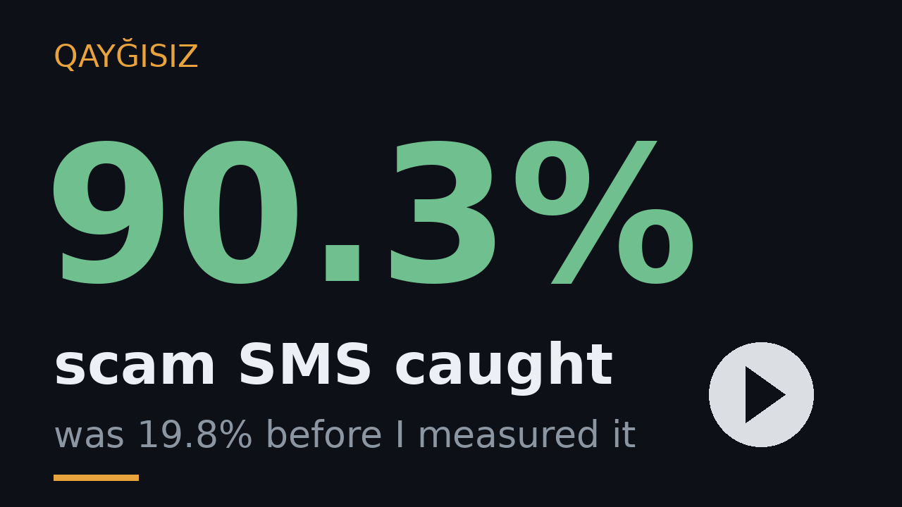

# Qayğısız

[](https://github.com/oomer583/qaygisiz/actions/workflows/tests.yml)

**An Android app that catches scam SMS on an elderly person's phone and warns their family — not them.**

Built for EurekaDev 2026 (Coding Track) by Ömər Kərimli, 14, Baku, Azerbaijan.

<p align="center">
  <a href="https://www.youtube.com/watch?v=5FdfSbqueGE">
    
  </a>
</p>

The installable, signed APK is on the **Releases** page of this repository.

---

## The problem

Scam SMS works because it targets the person least able to judge it. An elderly person gets a message saying their bank account is blocked, with a link. They are frightened, they are not going to inspect a domain name, and they often do not want to bother their children with it.

Every existing app I looked at warns **the person who received the message**. That is the one person whose judgement the scam has already defeated.

## What Qayğısız does differently

The warning goes to a **designated family member** over Telegram. The elderly user is never shown a scary dialog, never asked to make a decision, and never has to understand what a shortened URL is. Their son or daughter gets a message in plain language and calls them.

## How it works

```
SMS arrives
   |
   v
[ on-device scoring ]      free, instant, no network
   |  lookalike bank domains, URL shorteners, bare IP links,
   |  punycode, suspicious TLDs, urgency wording, sender mismatch
   |
   +-- clean  -> nothing happens, nothing leaves the phone
   |
   v  suspicious or dangerous
[ AI explanation ]         OpenRouter (free models) -> Gemini fallback
   |  turns the technical findings into two plain sentences
   v
[ Telegram ]               sent to the family member's chat
```

The local layer exists so the app is free to run. Only flagged messages ever leave the device — a normal SMS is scored and forgotten without a single network call.

The model layer has four levels of fallback (three free OpenRouter models, then Gemini). A warning system that goes silent because one provider is busy is not a warning system.

## Privacy

- Clean messages never leave the phone.
- Only a flagged message's text is sent to the model provider, for the explanation.
- No account, no server of our own, no analytics.
- The Telegram bot token and chat ID live in the app's private storage on the device.

## Languages

Azerbaijani, English and Russian. The detection layer returns reason **codes**, not strings, so adding a language is one file. The AI explanation follows the selected language.

## Install it

The signed APK is on the [Releases](https://github.com/oomer583/qaygisiz/releases) page of this repository. Download the `.apk` file from the latest release and install it on the phone you want to protect.

## Build it yourself

```bash
git clone https://github.com/oomer583/qaygisiz.git
cd qaygisiz
```

Two files are not in the repository because they hold credentials. Create them:

**1. `app/src/main/java/com/omer/qaygisiz/Secrets.kt`** — copy `Secrets.kt.example` and fill in what you have. All four values may be left empty; the app will simply ask for them on its setup screen.

**2. `keystore.properties`** — only needed for a signed release build. Skip it and `assembleDebug` still works.

```bash
./gradlew test            # unit tests for the detection layer, no device needed
./gradlew assembleDebug   # installable APK
```

## Using it

1. Install the APK on the phone you want to protect.
2. In Telegram, create a bot with [@BotFather](https://t.me/BotFather) and copy the token.
3. The family member who should receive the warnings opens the bot and presses Start.
4. Open `https://api.telegram.org/bot<TOKEN>/getUpdates` and read the `chat.id`.
5. Enter the token and the chat ID on the app's setup screen, choose a language, say who is being protected, grant the SMS permission, and press **Send a test message**.

Steps 2 to 4 are the part that still asks too much of an ordinary user. Replacing them with a single "Link Telegram" button is the next thing on the list.

## Does it work

Measured against a public, peer-reviewed corpus of 4,538 real Azerbaijani SMS
(Shahbazov 2026, doi:10.25045/jpit.v17.i1.04), on the half of it that was held out
while the rules were written:

| | first version | this version |
|---|---|---|
| smishing caught | 19.8% | **90.3%** |
| legitimate messages falsely flagged | 1.9% | **1.9%** |

Two TF-IDF classifiers trained on the other half score 84.6% and 81.9% recall on the
same held-out messages, at lower precision. This detector needs no model file and no
network call, and it reports which signals fired.

Full method, the exact split, the per-signal breakdown and the limitations:
[MEASUREMENT.md](MEASUREMENT.md).

## What it does not do

It does not stop the phone's owner from tapping the link. Android gives no way to block
that without becoming the default SMS app, which would make Qayğısız far more invasive
than it needs to be. What it relies on instead is speed: the warning reaches the family
member within seconds, usually before the owner has decided what to do. That is a real
gap, and I would rather state it than let someone find it.

## Tests

`./gradlew test` runs 19 tests on the JVM: no emulator, no SIM card, no network and no
API key. Eighteen of them pin the detection layer down. The nineteenth is the corpus
measurement, and it is skipped unless `corpus/dataset.csv` is present, so a clean clone
still builds.

Six cases must stay silent — ordinary chat, a real bank balance notification, a link to a
genuine bank domain, a payment confirmation from a deep subdomain of one, a telecom using
a link shortener, and a cheap TLD on its own — because an alert that cries wolf is worse
than no alert at all: the family member stops reading it.

Six cover links that impersonate: a lookalike bank domain, a message that speaks for
Azerpoct while the link goes somewhere else, a punycode lookalike, a bare IP address with
urgency wording, a bare IP address on its own, and a shortened link with urgency wording.

Three cover scams with no link at all — a prize with a callback number, a premium-rate
line disclosing its per-minute price, and "text this word to this short code". Four of the
five messages the detector used to miss looked like these.

Three cover language handling and reporting: Azerbaijani diacritics matched against an
ASCII keyword list, the *tasdiq* spelling that cost most of one campaign, and the detected
URL being reported back to the caller.

## Tech

Kotlin, Jetpack Compose, Material 3. `BroadcastReceiver` for SMS, `SharedPreferences` for settings, `HttpURLConnection` for the two HTTP calls. No third-party libraries — the dependency list is what Android Studio generates plus nothing.

`minSdk 24`, so it runs on phones from 2016 onward. The people this app protects do not have new phones.

## What is not done yet

- One shared bot with a one-tap pairing flow, instead of asking the user to create their own.
- Reading WhatsApp messages through a notification listener.
- A history screen showing what was flagged and when.
- A corpus of real Azerbaijani scam messages collected in the field, so that no part of it is translated from older English spam.

## Licence

MIT.
